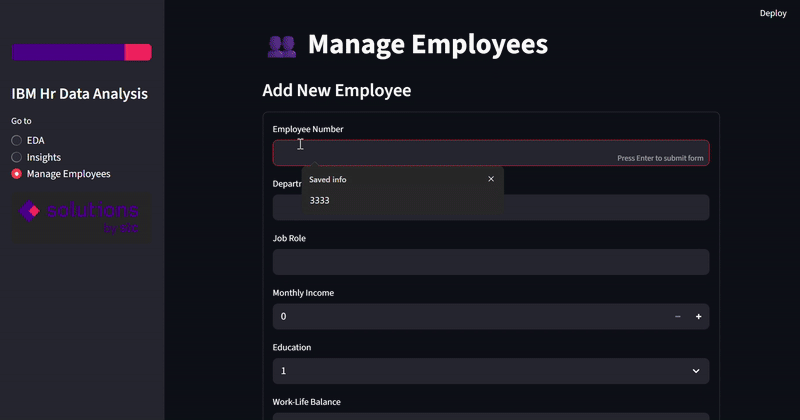

# 📊 IBM HR Employee Dashboard
An interactive HR analytics dashboard that helps organizations uncover attrition trends, explore workforce insights, and make data-driven retention decisions.

  
  
  
  
  

---

## 📑 Table of Contents
- [📖 Project Overview](#-project-overview)
- [📂 Data Source ](#-data-source)
- [🚀 Features](#-features)
- [📂 Project Structure](#-project-structure)
- [🛠 Tools & Apps Needed](#-tools--apps-needed)
- [⚡ Setup & Run (with Conda)](#-setup--run-with-conda)
- [🎥 Visual Demo ](#-visual-demo)
- [📸 Screenshots](#-screenshots)

---


## 📖 Project Overview

An interactive **Streamlit web app** for analyzing IBM HR Employee data.
It allows you to explore the dataset, generate insights with **Pandas or SQL**, and manage employee records directly.

### 🎯 Purpose

Employee attrition  is a critical challenge for organizations. High attrition leads to increased recruitment costs, training expenses, and loss of organizational knowledge.

### 🛠 Problem it Solves

*Helps HR teams understand why employees leave by analyzing factors like overtime, work-life balance, salary, and performance.

*Provides interactive insights via visualizations.

*Allows HR managers to add, update, or remove employees from the database for scenario testing.

### 💡 Value

Enables data-driven HR decisions.

Identifies potential retention strategies.

Provides a reusable framework for analyzing attrition in any organization with similar data.


---

## 📂 Data Source

This dataset comes from Kaggle:
https://www.kaggle.com/datasets/pavansubhasht/ibm-hr-analytics-attrition-dataset

---

## 🚀 Features

* **Database Setup**

  * If `employees.db` is missing, it is created automatically from the CSV file.

* **EDA (Exploratory Data Analysis)**

  * Dataset preview with column explanations
  * Missing values overview
  * Column distribution plots

* **Insights**

  * Switch between **DataFrame (Python)** and **Database (SQL)** modes
  * KPIs (Total Employees, Attrition Rate, Performance Rating, Income)
  * Charts:

    * Employees per Department
    * Avg Monthly Income by Job Role
    * Avg Performance by Department
    * Overtime vs Attrition by Department
    * Top 5 Employees by Performance
    * Income by Education
    * Attrition vs Work-Life Balance

* **Manage Employees**

  * Add new employees
  * Update employee details
  * Delete employees

---

## 📂 Project Structure

```bash
HR Project/
│── app.py                       # Main Streamlit app
│── requirements.txt              # Pip dependencies
│── environment.yml               # Conda dependencies
│── README.md                     # Documentation
│── LICENSE                       # License file
│── .gitignore                    # Ignore unnecessary files
│
├── Data/                         # All data files
│   ├── employees.db
│   └── WA_Fn-UseC_-HR-Employee-Attrition.csv
│
├── Notebooks/                    # Jupyter notebooks
│   └── IBM_HrData_Notebook.ipynb
│
└── Images/                       # Screenshots & logos
    ├── top_banner.png
    ├── bottom_banner.png
    ├── Screenshot_2025-09-18_172604.png
    ├── Screenshot_2025-09-18_172634.png
    ├── Screenshot_2025-09-18_172709.png
    ├── Screenshot_2025-09-18_172721.png
    ├── Dashboard_Demo_Filter.gif
    └── Dashboard_Demo_Add_Employee.gif

```

---

## 🛠 Tools & Apps Needed

To run this project you will need:

* **Python 3.9+**
* **Conda** (Anaconda or Miniconda)
* **Streamlit**
* **Jupyter Notebook**
* **SQLite**
* **VS Code**

---

## ⚡ Setup & Run (with Conda)

1. **Clone or Download** this project folder.

2. **Install Anaconda / Miniconda**

3. **Create a new environment and run the app**

     1. *Option A – Using Conda (recommended)*

   ```bash
   git clone https://github.com/hayaAlkhathran/IBM_Hr_DataAnalysis.git
   cd IBM_Hr_DataAnalysis
   conda env create -f environment.yml
   conda activate IBMHRDataAnalysis
   streamlit run app.py
   ```

      2. *Option B – Using pip*

   ```bash
   git clone https://github.com/hayaAlkhathran/IBM_Hr_DataAnalysis.git
   cd IBM_Hr_DataAnalysis
   conda create -n IBMHRDataAnalysis python=3.10 -y
   conda activate IBMHRDataAnalysis
   pip install -r requirements.txt
   streamlit run app.py
   ```

---
## 🎥 Visual Demo  
# Filter by Department
  
# Add Employee
   

---
## 📸 Screenshots

### 🔎 EDA Page


### 📈 Insights Page


### 🍩 Average Performance by Department


### 👥 Manage Employees Page


